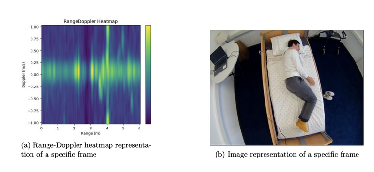

# Thesis on Sleep Posture Recognition Using mmWave Radars and Deep Learning

## **Abstract**
The recognition of sleep posture is crucial across multiple domains, including:

- **Sleep Healthcare**
- **Care for Bedridden Patients**
- **Diagnosis of Chronic Diseases**

Recent research has increasingly focused on utilizing **deep neural networks** for human posture classification using **mmWave Radars**. This thesis investigates the efficacy of neural networks in classifying sleep postures—**supine**, **lateral**, and **prone**—by leveraging augmented data and analyzing transition states between static postures. The results demonstrate a significant improvement, with accuracy ranging from a baseline model of **77%** to a final theoretical state machine result of **93%**.

## **Skills**
- **Python**
- **PyTorch**
- **NumPy**
- **Pandas**
- **TensorBoard**
- **Radar – Texas Instruments IWR6843 AOP**

---

Feel free to explore the detailed implementation and results in the [article](https://drive.google.com/file/d/10_HBm2id6-Zkf7B1MfKB-SJZ3KDljbHs/view) or the full version of the [thesis](https://drive.google.com/file/d/1WWa_mYWF-Mln6dDwImnmDZ0IeA5gYVDP/view).
